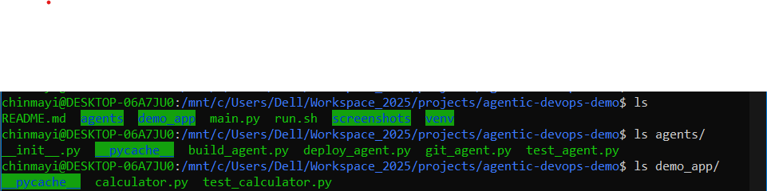
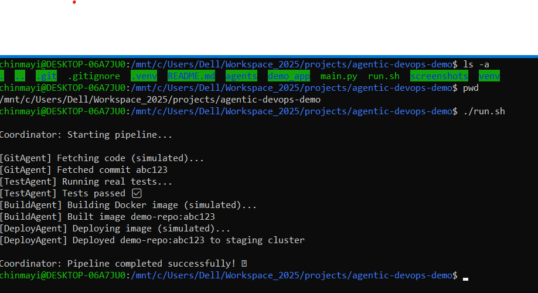

# Agentic DevOps Demo

A step-by-step demonstration of building an **Agentic CI/CD system** using Python, Docker, Jenkins, Argo CD, and Kubernetes. This project simulates a DevOps workflow using multiple agents.

---

## Table of Contents

1. [Project Overview](#project-overview)  
2. [Folder Structure](#folder-structure)  
3. [Prerequisites](#prerequisites)  
4. [Installation](#installation)  
5. [Project Structure and Explanation](#project-structure-and-explanation)  
6. [How to Run](#how-to-run)  
7. [Screenshots](#screenshots)  
8. [Technologies Used](#technologies-used)  
9. [Future Improvements](#future-improvements)  
10. [Author](#author)  

---

## Project Overview

The `agentic-devops-demo` project demonstrates the automation of CI/CD workflows using **multiple agent scripts** in Python. It integrates the following:

- Python scripts simulating agents (`build_agent.py`, `deploy_agent.py`, `test_agent.py`, etc.)  
- Docker containerization  
- Kubernetes deployment (optionally Minikube for local testing)  
- Jenkins pipeline (CI/CD)  
- Argo CD and Helm for deployment automation  

---

## Folder Structure

The project has the following folder structure:

agentic-devops-demo/
├── README.md
├── main.py
├── run.sh
├── agents/
│ ├── build_agent.py
│ ├── deploy_agent.py
│ ├── git_agent.py
│ ├── test_agent.py
│ └── __pycache__/
├── demo_app/
│ ├── calculator.py
│ ├── test_calculator.py
│ └── __pycache__/
├── screenshots/ 
└── venv/ # Python virtual environment

## Prerequisites

Before running the project, ensure the following are installed:

- Python 3.12+  
- Docker  
- Kubernetes (`kubectl`, Minikube optional)  
- Jenkins (for CI/CD pipeline)  
- Argo CD (for GitOps deployment)  
- Helm (for managing Kubernetes charts)  

---

## Installation

1. Clone the repository:

git clone <https://github.com/gitchinmayi/agentic-devops-demo.git>
cd agentic-devops-demo

2. Create and activate a virtual environment:

python3 -m venv venv
source venv/bin/activate   # Linux / Mac
venv\Scripts\activate      # Windows

3. Install dependencies (if any):

pip install -r requirements.txt

## Project Structure and Explanation

**main.py**  
Entry point for running the agentic simulation. Calls multiple agent scripts in sequence.

**run.sh**  
Shell script to automate running the Python project in Linux/Mac environments.

**agents/**  
- build_agent.py → Handles build operations  
- deploy_agent.py → Handles deployment steps  
- git_agent.py → Interacts with Git repository  
- test_agent.py → Runs tests on demo app  

**demo_app/**  
- calculator.py → Simple demo application for testing agents  
- test_calculator.py → Contains unit tests for the demo app  

**screenshots/**  
Contains screenshots for reference

A simple demo application (calculator.py) for testing agents.

test_calculator.py contains unit tests for the demo app.

screenshots/
## Screenshots

## How to Run

Activate the virtual environment:

source venv/bin/activate

Run the project:

./run.sh

Observe the outputs in the terminal.

##Technologies Used

Python 3.12

Docker

Kubernetes (Minikube)

Jenkins

Argo CD

Helm

Git

##Future Improvements

Integrate full CI/CD pipeline with Jenkinsfile.

Automate Kubernetes deployments with Helm charts.

Add more agents for monitoring, logging, and alerting.

##Author

Chinmayi Hiremath

GitHub: https://github.com/gitchinmayi

LinkedIn: https://www.linkedin.com/in/chinmayi-hiremath

